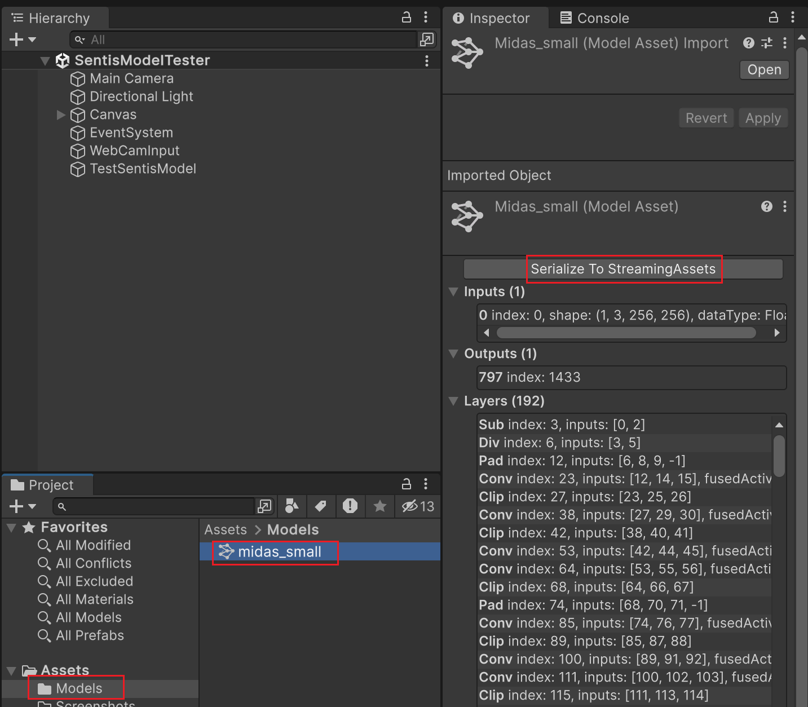

# Sentis Model Tester v1.1

Sentis Model Tester is a tool that allows you to quickly test various ONNX models in Unity Sentis. It can also compare Sentis inference outputs to ONNX-Runtime inference outputs.  
[Unity Sentis](https://unity.com/products/sentis) is the AI/ML inference engine that runs in Unity 3D. It requires Unity Editor v2023.2 or later.

## How to Use
* Open `SentisModelTester`-scene in the `Assets`-folder. 
* Run the scene to see how it works. It does continuous inferences of the model (in full or in parts) and can display a selected model output as image, as well as the time of inference and number of layers executed.
* Click the Game View. This should run comparison between Sentis inference outputs and ONNX-Runtime (ORT) inference outputs.
* The results of the comparison (tensor by tensor and the total) will be displayed on screen.
* The ORT and Sentis output tensors (as shapes and data) will be displayed in the console.

## How to Change the Model
* To change the model, first select `TestSentisModel`-game object in Hierarchy. See the image below.
* Set the ONNX model of interest by dragging it from the `Assets/Models`-folder to the `Model asset`-field of `ModelTester`-component.
* Change the input source if needed. See `How to Change Input` below.
* Change the model-tester options, if needed. See `Model Tester Options` below.
* Run the scene to see the inference timing. 
* Click the Game View to make comparison with ONNX-Runtime, and to see the results.

## How to Change Input
* To change the input, select `WebCamInput`-game object in Hierarchy. See the image below.
* If you'd like to change the video, copy the video clip to the `Assets/Textures`-folder and then drag it to the `Video Clip`-setting of `Video Player`-component.
* If the new video has a different resolution, you can create a new render-texture with that resolution and update `Target texture` of `Video Player`-component accordingly. Don't forget to update the `Static input`-setting of `WebCamInput`-component as well.
* If you'd like to set a static image as model input, copy it to the `Assets/Textures`-folder and set its `Texture type` to `Editor GUI and Legacy GUI`. Then drag it to the `Static input`-setting of `WebCamInput`-component. In this case feel free to disable the `Video Player`-component, because although useless it may still run and affect performance.
* If you'd like to use the web-camera image as model input, clear the `Static input`-setting of `WebCamInput`-component.
* In case of webcam input, you can set the webcam name or resolution, if you prefer a specific camera or resolution.

## Model Tester Options
* To update the Model-Tester options, first select `TestSentisModel`-game object in Hierarchy. See the image below.
* If you'd like to test the model with a different Sentis backend, select it from the `Backend Type`-dropdown before running the scene. 
    * `GPU Compute` backend uses compute shaders on GPU (fast).
    * `GPU Pixel` backend uses pixel shaders on GPU (relatively slow).
    * `CPU` backend does the inference on CPU (slow).
* Use the `Input Conversion` options to change the conversion of source image to input tensor. Please consult the model requirements. 
    * `Resize`-option resizes the source image to input resolution.
    * `Crop`-option resizes and crops the source image according to its minimum dimension (width or height).
    * `Letterbox`-option creates a letterbox input image, with black horizontal or vertical strips, according to the source image aspect ratio.
* By setting `Frames to Execute` to more than 1, you can spread the model execution across several frames.
* If the model produces an image tensor, you can set `Output Tensor as Image` to the index of the output tensor you'd like to visualize. Output tensor indices start at 0. `-1` means no output sensor will be displayed on screen.
* In case an output tensor gets displayed on screen, you can enable 'Normalize output' to recalculate the tensor data to fit in the interval [0, 1] before displaying it as image.

## How to Export Model to Sentis Format
* To export the ONNX model to a file in Sentis format, select the model in `Assets/Models`-folder. See the image below.
* Press `Serialize to StreamingAssets`-button.
* Find the exported model (in Sentis-format) in `Assets/StreamingAssets`-folder.
* When you select the ONNX model, you can also see more details about it, such as the required input tensors and their shapes, the output tensors, model layers & constants, as well as errors or warnings related to the model layers. Please note, such errors or warnings may cause incorrect model inferences later.

## Updates

* (v1.1) Updated Sentis to v2.0. Fixed breaking changes.

